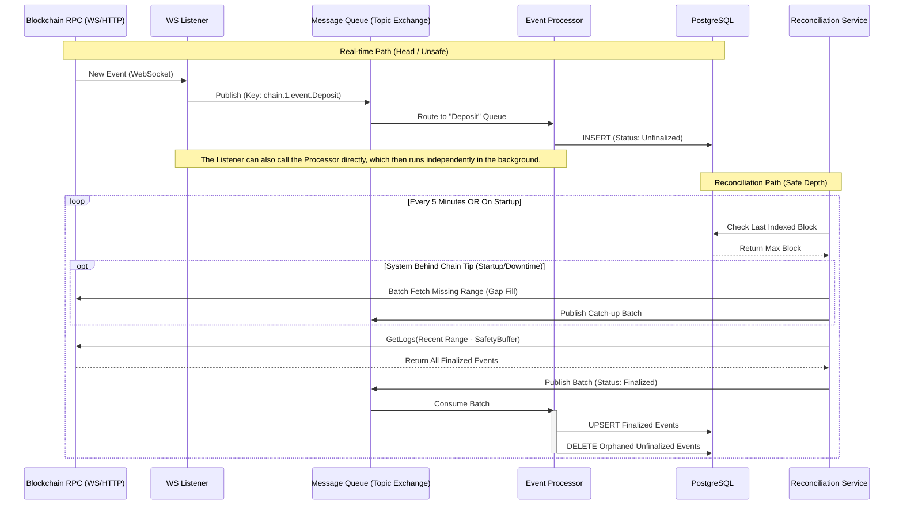

# Indexer

This package is meant to read data from an rpc provider, modify it as necessary and insert into a database.

## Run

Using Docker:

From the root folder, run:

- `pnpm run dev-env:up`
- `pnpm run dev-env:run-app:indexer` this command will execute migrations if needed and run the indexer.

Without docker:

1. Set the database connection environment variables in packages/indexer-database/.env
2. From packages/indexer-database run `pnpm run db:migration:run` or from the root folder run `pnpm run db:indexer-database:migrate:run`.
3. Go to apps/node and run `APP=indexer pnpm start` or from the root folder run `pnpm run start:indexer`

## Testing

This package includes unit, integration, and non-Docker end-to-end (E2E) tests.

**Test File Naming Conventions**:
To ensure proper test execution with the new commands, please adhere to the following naming conventions for your test files:

- **Unit Tests**: Files should end with `*.unit.test.ts`
- **Integration Tests**: Files should end with `*.integration.test.ts`
- **Docker E2E Tests**: Files should end with `*.e2e.test.ts`

**Configuration**:
For these tests to run correctly, you need to provide RPC URLs for the testnet chains. Create a `.env.test` file at the **root of the repository** (if it doesn't already exist) and add the necessary RPC provider URLs.

For example, if running CCTP tests that interact with Arbitrum Sepolia (chain ID 421614), you must include:

```
RPC_PROVIDER_URLS_421614="<your_arbitrum_sepolia_rpc_url>"
```

**Running Tests**:
Navigate to the `packages/indexer` directory to run the following commands:

- **Run all tests (Unit, Integration, and E2E)**:
  ```bash
  pnpm test
  ```
- **Run only Unit Tests**:
  ```bash
  pnpm test:unit
  ```
- **Run only Integration Tests**:
  ```bash
  pnpm test:integration
  ```
- **Run only E2E Tests**:
  ```bash
  pnpm test:e2e
  ```

## ENV

```
DATABASE_HOST=localhost
DATABASE_PORT=5432
DATABASE_USER=user
DATABASE_PASSWORD=password
DATABASE_NAME=mydatabase

REDIS_HOST=localhost
REDIS_PORT=6380

RPC_PROVIDER_URLS_1=https://mainnet.infura.io/v3/xxx
RPC_PROVIDER_URLS_10=https://optimism-mainnet.infura.io/v3/xxx
RPC_PROVIDER_URLS_137=https://polygon-mainnet.infura.io/v3/xxx
HUBPOOL_CHAIN=1
SPOKEPOOL_CHAINS_ENABLED=1,2
PROVIDER_CACHE_TTL=3600

// optional
PROVIDER_CACHE_NAMESPACE=indexer_provider_cache
NODE_MAX_CONCURRENCY=1
NODE_PCT_RPC_CALLS_LOGGED_=100
STANDARD_TTL_BLOCK_DISTANCE=1
NO_TTL_BLOCK_DISTANCE=1000
PROVIDER_CACHE_TTL=100000
NODE_QUORUM=1
NODE_RETRIES=2
NODE_RETRY_DELAY=1000

ENABLE_HUBPOOL_INDEXER=true
ENABLE_BUNDLE_EVENTS_PROCESSOR=true
ENABLE_BUNDLE_INCLUDED_EVENTS_SERVICE=true
ENABLE_BUNDLE_BUILDER=true
ENABLE_PRICE_WORKER=false
CCTP_INDEXER_CHAIN_IDS=42161
ENABLE_CCTP_FINALIZER=false

PUBSUB_CCTP_FINALIZER_TOPIC=
PUBSUB_GCP_PROJECT_ID=

COINGECKO_API_KEY=
BUNDLE_EVENTS_SERVICE_START_BLOCK_NUMBER=
INDEXING_DELAY_SECONDS=
```

## Websocket Indexer

The Websocket Indexer provides a high-performance, push-based indexing system. It runs as an integrated service within the main indexer application.

### Architecture Overview

The Websocket Indexer implements a push-based architecture to address the latency and inefficiency of traditional polling. Instead of repeatedly querying for new blocks, it uses a WebSocket connection to receive events as soon as they are emitted by the blockchain.

The main components are:

- **WebSocket Listener**: Establishes a single WebSocket connection per chain, subscribing to all relevant events. It's a generic service that publishes raw event data.
- **Event Processor**: Consumes events, transforms them into a structured format, and stores them in the database. In this implementation, this is called directly by the listener.
- **Reconciliation Service**: Periodically validates indexed data against the blockchain to ensure data integrity, handling block reorgs and filling gaps.

This decoupled approach improves scalability, reduces resource consumption, and enhances data integrity.

#### Data Flow Diagram

The following diagram illustrates the data flow. Note that while the full architecture can use a message queue (MQ) for maximum resilience, the current implementation features a more direct communication path where the **Listener calls the Processor directly**, and the processor runs independently in the background.



### Getting Started
To run the websocket indexer, execute the following command from the **root** of the monorepo:

```bash
# Enable the WebSocket indexer via environment variable
ENABLE_WEBSOCKET_INDEXER=true pnpm start:indexer
```

You can also specify which chains to index using `WS_INDEXER_CHAIN_IDS`.

```bash
# Example: Index Arbitrum One and Arbitrum Sepolia
ENABLE_WEBSOCKET_INDEXER=true WS_INDEXER_CHAIN_IDS=42161,421614 pnpm start:indexer
```

This will start the websocket indexer services as part of the main application startup. The system is configured via `src/data-indexing/service/config.ts`.

### Development Guide

The websocket indexer uses a configuration-driven architecture centrally managed in `src/data-indexing/service/config.ts`.

#### How to Add a New Chain

To index a new blockchain:

1.  Open `src/data-indexing/service/config.ts`.
2.  Update `getChainProtocols()` function to include the events configuration for the desired chains.

```typescript
export const getChainProtocols: (config: Config) => Record<
number,
SupportedProtocols<
  Partial<typeof Entity>,
  BlockchainEventRepository,
  IndexerEventPayload,
  EventArgs
>[]> = (config: Config) => {
  // Add OFT protocol events configuration
  ...

  // Add CCTP protocol events configuration
  ...

  // Add your events configuration
  return chainProtocols;
};
```

#### How to Add a New Event

To listen to a new event (or protocol):

1.  Define a new `SupportedProtocols` object (or update an existing one like `CCTP_PROTOCOL`).
2.  Implement the `getEventHandlers` function.
3.  Return an array of event handler configurations, where each handler includes:
    *   `config`: Contract address, ABI, and event name.
    *   `preprocess`, `filter`, `transform`, `store`: The pure functions for the pipeline.

```typescript
export const MY_NEW_PROTOCOL: SupportedProtocols<...> = {
  getEventHandlers: (testNet, logger) => [
    {
      config: { ... },
      preprocess: ...,
      filter: ...,
      transform: ...,
      store: ...
    }
  ]
};
```

### Testing

Tests for the websocket indexer are part of the integration test suite.

```bash
pnpm test:integration
```

## Graceful Shutdown and the AbortController Pattern

The indexer uses the standard [AbortController](https://developer.mozilla.org/en-US/docs/Web/API/AbortController) and [AbortSignal](https://developer.mozilla.org/en-US/docs/Web/API/AbortSignal) pattern to handle graceful shutdowns. This ensures that long-running tasks, such as indexing loops and background workers, stop immediately and cleanly when the application receives a termination signal (`SIGINT` or `SIGTERM`).


### How to use it
Contributors should follow these rules when implementing new services or background tasks:

1.  **Accept an `AbortSignal`**: Any class or function that starts a long-running process should accept an `AbortSignal` in its `start()` or constructor method.
2.  **Check the Signal in Loops**: In any `while` or `for` loop that runs indefinitely or for a long time, check `signal.aborted`.
    ```typescript
    while (!signal.aborted) {
      // do work
    }
    ```
3.  **Pass the Signal Down**: If your function calls other async functions that support `AbortSignal`, pass the signal along.
4.  **Use `delayWithAbort`**: Never use a plain `await new Promise(r => setTimeout(r, ms))`. Instead, use the helper `delayWithAbort` from `src/utils/asyncUtils.ts`. This ensures the wait is cancelled immediately if the system shuts down.

### When is it mandatory?
- **Infinite Loops**: Any service that "polls" or loops forever.
- **Retry Logic**: If you are implementing a retry loop that waits between attempts.
- **Long-running Tasks**: Any task that takes more than a few seconds to complete.

### When is it optional?
- **Quick Operations**: Single database queries or short CPU-bound tasks that are guaranteed to finish in milliseconds.
- **Stateless Pure Functions**: Functions that don't perform I/O or have side effects.

The root `AbortController` is managed in `packages/indexer/src/main.ts`, which signals the abort when a shutdown is triggered.
