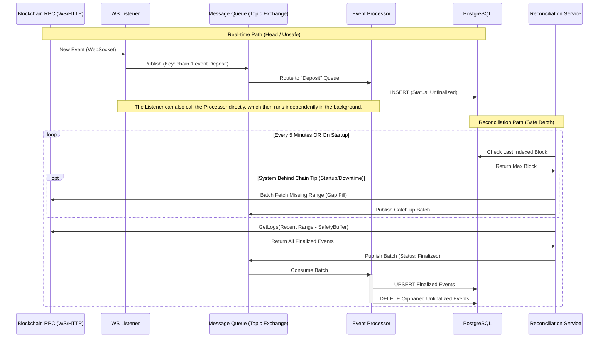

# Indexer
This package is meant to read data from an rpc provider, modify it as necessary and insert into a database.

## Run
Using Docker:

From the root folder, run:
- `pnpm run dev-env:up`
- `pnpm run dev-env:run-app:indexer` this command will execute migrations if needed and run the indexer.

Without docker:

1. Set the database connection environment variables in packages/indexer-database/.env
2. From packages/indexer-database run `pnpm run db:migration:run` or from the root folder run `pnpm run db:indexer-database:migrate:run`.
3. Go to apps/node and run `APP=indexer pnpm start` or from the root folder run `pnpm run start:indexer`

## Testing

This package includes unit, integration, and non-Docker end-to-end (E2E) tests.

**Test File Naming Conventions**:
To ensure proper test execution with the new commands, please adhere to the following naming conventions for your test files:
*   **Unit Tests**: Files should end with `*.unit.test.ts`
*   **Integration Tests**: Files should end with `*.integration.test.ts`
*   **Docker E2E Tests**: Files should end with `*.e2e.test.ts`

**Configuration**:
For these tests to run correctly, you need to provide RPC URLs for the testnet chains. Create a `.env.test` file at the **root of the repository** (if it doesn't already exist) and add the necessary RPC provider URLs.

For example, if running CCTP tests that interact with Arbitrum Sepolia (chain ID 421614), you must include:

```
RPC_PROVIDER_URLS_421614="<your_arbitrum_sepolia_rpc_url>"
```

**Running Tests**:
Navigate to the `packages/indexer` directory to run the following commands:

*   **Run all tests (Unit, Integration, and E2E)**:
    ```bash
    pnpm test
    ```
*   **Run only Unit Tests**:
    ```bash
    pnpm test:unit
    ```
*   **Run only Integration Tests**:
    ```bash
    pnpm test:integration
    ```
*   **Run only E2E Tests**:
    ```bash
    pnpm test:e2e
    ```

## ENV
```
DATABASE_HOST=localhost
DATABASE_PORT=5432
DATABASE_USER=user
DATABASE_PASSWORD=password
DATABASE_NAME=mydatabase

REDIS_HOST=localhost
REDIS_PORT=6380

RPC_PROVIDER_URLS_1=https://mainnet.infura.io/v3/xxx
RPC_PROVIDER_URLS_10=https://optimism-mainnet.infura.io/v3/xxx
RPC_PROVIDER_URLS_137=https://polygon-mainnet.infura.io/v3/xxx
HUBPOOL_CHAIN=1
SPOKEPOOL_CHAINS_ENABLED=1,2
PROVIDER_CACHE_TTL=3600

// optional
PROVIDER_CACHE_NAMESPACE=indexer_provider_cache
NODE_MAX_CONCURRENCY=1
NODE_PCT_RPC_CALLS_LOGGED_=100
STANDARD_TTL_BLOCK_DISTANCE=1
NO_TTL_BLOCK_DISTANCE=1000
PROVIDER_CACHE_TTL=100000
NODE_QUORUM=1
NODE_RETRIES=2
NODE_RETRY_DELAY=1000

ENABLE_HUBPOOL_INDEXER=true
ENABLE_BUNDLE_EVENTS_PROCESSOR=true
ENABLE_BUNDLE_INCLUDED_EVENTS_SERVICE=true
ENABLE_BUNDLE_BUILDER=true
ENABLE_PRICE_WORKER=false
CCTP_INDEXER_CHAIN_IDS=42161
ENABLE_CCTP_FINALIZER=false

PUBSUB_CCTP_FINALIZER_TOPIC=
PUBSUB_GCP_PROJECT_ID=

COINGECKO_API_KEY=
BUNDLE_EVENTS_SERVICE_START_BLOCK_NUMBER=
INDEXING_DELAY_SECONDS=
```

## Indexer Sandbox

The Indexer Sandbox provides a lightweight, isolated environment for developing and testing the push-based indexing system. It runs on `MainSandbox` in `src/main.ts` and is designed for rapid iteration.

### Architecture Overview

The sandbox implements a push-based architecture to address the latency and inefficiency of traditional polling. Instead of repeatedly querying for new blocks, it uses a WebSocket connection to receive events as soon as they are emitted by the blockchain.

The main components are:
- **WebSocket Listener**: Establishes a single WebSocket connection per chain, subscribing to all relevant events. It's a generic service that publishes raw event data.
- **Event Processor**: Consumes events, transforms them into a structured format, and stores them in the database. In the sandbox, this is called directly by the listener.
- **Reconciliation Service**: Periodically validates indexed data against the blockchain to ensure data integrity, handling block reorgs and filling gaps.

This decoupled approach improves scalability, reduces resource consumption, and enhances data integrity.

#### Data Flow Diagram

The following diagram illustrates the data flow. Note that while the full architecture can use a message queue (MQ) for maximum resilience, the sandbox implementation features a more direct communication path where the **Listener calls the Processor directly**, and the processor runs independently in the background.



### Getting Started

To run the indexer sandbox, execute the following command from the **root** of the monorepo:

```bash
pnpm start:indexer-sandbox
```

This will start the sandbox environment defined in `src/main.ts` under the `MainSandbox` function.

### Development Guide

The sandbox is designed to be easily extensible. Follow these steps to add new chains or events.

#### How to Add a New Chain

To index a new blockchain, you need to create a dedicated startup function for it, similar to `startArbitrumMainnetIndexer` in `src/data-indexing/service/indexers.ts`.

1.  **Create a new function**: For example, `startOptimismMainnetIndexer`. This function will contain the specific configuration for that chain.
2.  **Define the Configuration**: Inside this function, create an `IndexerConfig` object with the `chainId` and `rpcUrl`.
3.  **Call the new function**: Update the `MainSandbox` function in `src/main.ts` to call your new `startOptimismMainnetIndexer` function.

#### How to Add a New Event

To listen to a new event on an existing chain, you need to add an entry to the `events` array within that chain's `IndexerConfig`.

Each event entry is an object with three key properties:

-   `config`: Defines the event to listen for.
    -   `address`: The contract address emitting the event.
    -   `abi`: The ABI of the event.
    -   `eventName`: The name of the event.
-   `transform`: A function that takes the raw event log and transforms it into the desired database entity format.
-   `store`: A function that saves the transformed event data to the database.

**Example: Adding a `DepositForBurn` Event**

The following example from `startArbitrumMainnetIndexer` shows how to configure the indexer to listen for CCTP's `DepositForBurn` event.

```typescript
// Located in: src/data-indexing/service/indexers.ts

const ethConfig: IndexerConfig<
  Partial<typeof Entity>,
  dbUtils.BlockchainEventRepository,
  IndexerEventPayload
> = {
  chainId: CHAIN_IDs.ARBITRUM,
  rpcUrl,
  events: [
    {
      config: {
        address: TOKEN_MESSENGER_ADDRESS_MAINNET,
        abi: CCTP_DEPOSIT_FOR_BURN_ABI,
        eventName: DEPOSIT_FOR_BURN_EVENT_NAME,
      },
      transform: depositForBurnTransformer, // The specific transformation function
      store: storeDepositForBurnEvent,       // The specific storage function
    },
    // To add another event, add a new object here
  ],
};
```

To add a new event, you would:
1.  Define a new `transform` function (e.g., `myEventTransformer`).
2.  Define a new `store` function (e.g., `storeMyEvent`).
3.  Add a new object to the `events` array with the corresponding `config`, `transform`, and `store` values.

### Testing the Sandbox
Tests for the indexer sandbox are part of the integration test suite. The primary test file is located at `packages/indexer/src/data-indexing/tests/Indexers.integration.test.ts`.

To run the tests, execute the integration test command from the `packages/indexer` directory:
```bash
pnpm test:integration
```
This will validate the functionality of the chain-specific indexers, like `startArbitrumMainnetIndexer`, ensuring that events are correctly processed and stored.
