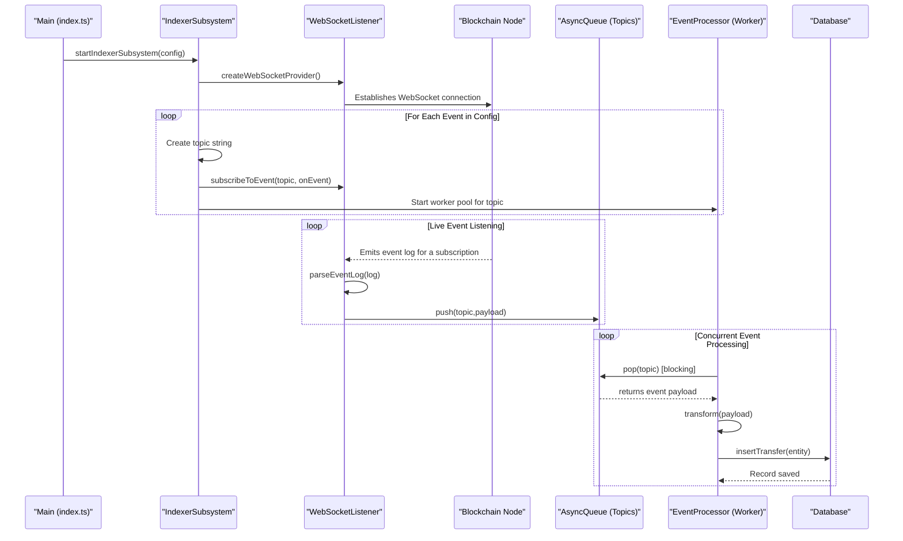

# Proof-of-Concept: Push-Based Blockchain Indexer

This repository contains a proof-of-concept (PoC) for a push-based blockchain event indexer, built with TypeScript and ethers.js.

It is designed to demonstrate a scalable and resilient architecture for ingesting on-chain events using WebSocket subscriptions, processing them through a decoupled pipeline, and storing them in a database.

## Architectural Overview

The indexer is based on a Publish/Subscribe (Pub/Sub) microservices pattern, which decouples the main components of the system for better scalability and resilience.

The core components are:

- **WebSocket Listener (Producer)**: Establishes a WebSocket connection to a blockchain node for each configured chain. It subscribes to specific events and pushes raw event data into a message queue.
- **Message Queue (Buffer)**: Acts as a resilient buffer between the listener and the processors. For this PoC, a simple in-memory `AsyncQueue` is used to simulate a real message broker like RabbitMQ.
- **Event Processor (Consumer)**: A pool of workers consumes events from the message queue. Each worker runs a generic processing pipeline:
  - **Fetch**: Grabs the next event from the queue.
  - **Transform**: Converts the raw event data into a structured database entity using a pure function.
  - **Store**: Saves the entity to the database.

This architecture is designed to be highly generic and scalable. Adding a new event to be indexed requires minimal code changes, primarily through configuration.

### Sequence Diagram

The following diagram illustrates the topic-based data flow from the blockchain node to the database.



## How to Run the Indexer

### Prerequisites

- Node.js
- pnpm (or your preferred package manager like npm or yarn)

### Installation

Install the project dependencies:

```bash
pnpm install
```

### Environment Configuration

The indexer requires a WebSocket RPC URL to connect to a blockchain node. You can provide this by creating a `.env` file in the root of this package (`packages/poc-push-based-indexer`).

Create a file named `.env` and add the following line:

```
RPC_URL=wss://your-websocket-rpc-url
```

For example, for Ethereum Mainnet, you can use a free public node or a private one from a provider like Infura or Alchemy:

```
RPC_URL=wss://ethereum-rpc.publicnode.com
```

### Running the Indexer

Once the dependencies are installed and the environment is configured, you can start the indexer with the following command:

```bash
npx ts-node src/index.ts
```

The application will start, connect to the configured WebSocket endpoint, and begin listening for UNI token `Transfer` events on the Ethereum mainnet. You will see log messages in your console as events are captured, published to a topic, and processed by the dedicated workers.

### Stopping the Indexer

You can stop the indexer gracefully by pressing `Ctrl+C` in the terminal where it is running.
